# Jittor-MLP
Unofficial Implementation of MLP-Mixer, gMLP, resMLP, Vision Permutator, S2MLP, S2MLPv2, RaftMLP, HireMLP, ConvMLP, SparseMLP, ConvMixer, AS-MLP, SwinMLP, RepMLPNet, WaveMLP, MorphMLP, DynaMixer, MS-MLP in Jittor and PyTorch. GFNet and CycleMLP in PyTorch.

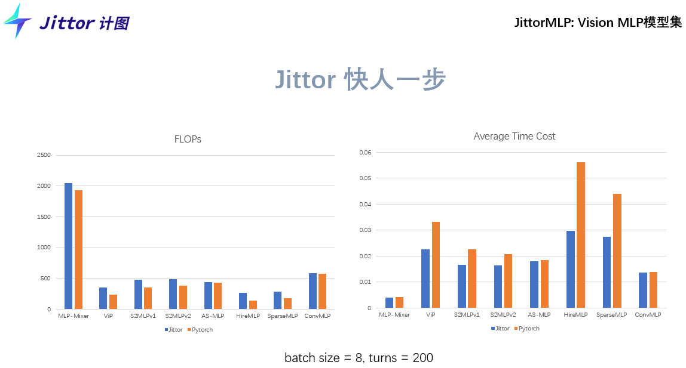


## What's New

**Are we ready for a new paradigm shift? A Survey on Visual Deep MLP** ([paper](https://arxiv.org/abs/2111.04060)).

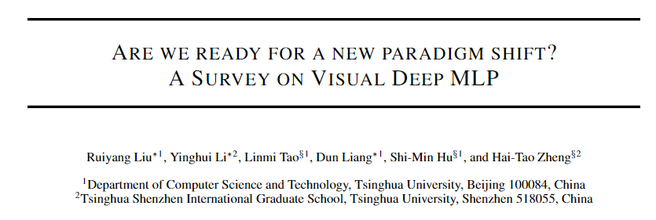

```bibtex
@article{liu2021we,
  title={Are we ready for a new paradigm shift? A Survey on Visual Deep MLP},
  author={Liu, Ruiyang and Li, Yinghui and Liang, Dun and Tao, Linmi and Hu, Shimin and Zheng, Hai-Tao},
  journal={arXiv preprint arXiv:2111.04060},
  year={2021}
}
```


**trunc\_normal\_** is supported for Jittor (Jittor vision  >= 1.3.15)!   (shown in ./models\_jittor/utils/init.py)

```python
import math
import warnings
import jittor as jt

    
def trunc_normal_(var, mean=0., std=1., a=-2., b=2.):
    # type: (jt.jittor_core.Var, float, float, float, float) -> jt.jittor_core.Var
    r"""Fills the input jt.jittor_core.Var with values drawn from a truncated
    normal distribution. The values are effectively drawn from the
    normal distribution :math:`\mathcal{N}(\text{mean}, \text{std}^2)`
    with values outside :math:`[a, b]` redrawn until they are within
    the bounds. The method used for generating the random values works
    best when :math:`a \leq \text{mean} \leq b`.
    Args:
        var: an n-dimensional `jt.jittor_core.Var` 
        mean: the mean of the normal distribution
        std: the standard deviation of the normal distribution
        a: the minimum cutoff value
        b: the maximum cutoff value
    Examples:
        >>> w = torch.empty(3, 5)
        >>> nn.init.trunc_normal_(w)
    """
    return _no_grad_trunc_normal_(var, mean, std, a, b)

def _no_grad_trunc_normal_(var, mean, std, a, b):
    # Cut & paste from PyTorch official master until it's in a few official releases - RW
    # Method based on https://people.sc.fsu.edu/~jburkardt/presentations/truncated_normal.pdf
    def norm_cdf(x):
        # Computes standard normal cumulative distribution function
        return (1. + math.erf(x / math.sqrt(2.))) / 2.

    if (mean < a - 2 * std) or (mean > b + 2 * std):
        warnings.warn("mean is more than 2 std from [a, b] in nn.init.trunc_normal_. "
                      "The distribution of values may be incorrect.",
                      stacklevel=2)

    
    # Values are generated by using a truncated uniform distribution and
    # then using the inverse CDF for the normal distribution.
    # Get upper and lower cdf values
    l = norm_cdf((a - mean) / std)
    u = norm_cdf((b - mean) / std)

    # Uniformly fill tensor with values from [l, u], then translate to
    # [2l-1, 2u-1].
    # var.uniform(2 * l - 1, 2 * u - 1)
    jt.init.uniform_(var, low=2 * l - 1, high=2 * u - 1)

    # Use inverse cdf transform for normal distribution to get truncated
    # standard normal
    var.erfinv()

    # Transform to proper mean, std
    var.multiply(std * math.sqrt(2.))
    var.add(mean)

    # Clamp to ensure it's in the proper range
    var.clamp(min_v=a, max_v=b)
    return var

```


**Rearrange, Reduce** in [einops](https://github.com/arogozhnikov/einops) for Jittor is support ! Easier to convert Transformer-based and MLP-based models from PyTorch to Jittor!

* from .einops\_my.layers.jittor import Rearrange, Reduce (shown in ./models\_jittor/raft\_mlp.py, ./models\_jittor/sparse\_mlp.py)


## Models

* Jittor and Pytorch implementaion of [MLP-Mixer: An all-MLP Architecture for Vision](https://arxiv.org/pdf/2105.01601.pdf).

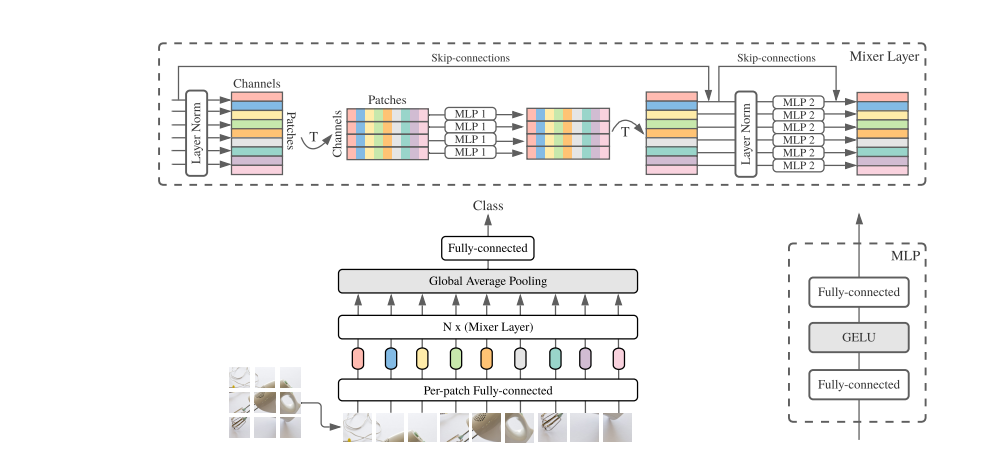

* Jittor and Pytorch implementaion of [VISION PERMUTATOR: A PERMUTABLE MLP-LIKE ARCHITECTURE FOR VISUAL RECOGNITION](https://arxiv.org/pdf/2106.12368).

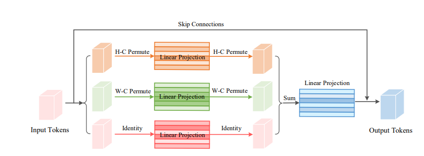


* Jittor and Pytorch implementaion of [gMLP](https://arxiv.org/abs/2105.08050)

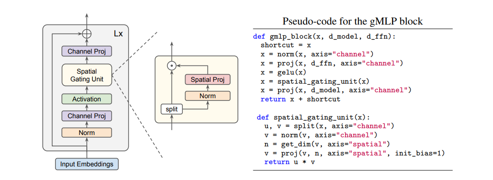

* Jittor and Pytorch implementaion of [ResMLP: Feedforward networks for image classification with data-efficient training](https://arxiv.org/abs/2105.03404).

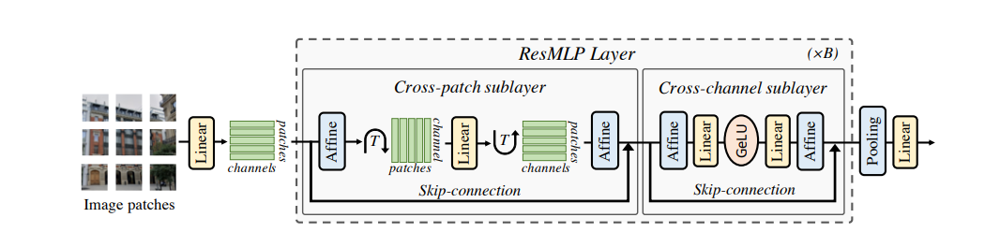

* Jittor and Pytorch implementaion of [S2-MLPv2: Improved Spatial-Shift MLP Architecture for Vision](https://arxiv.org/abs/2108.01072).

  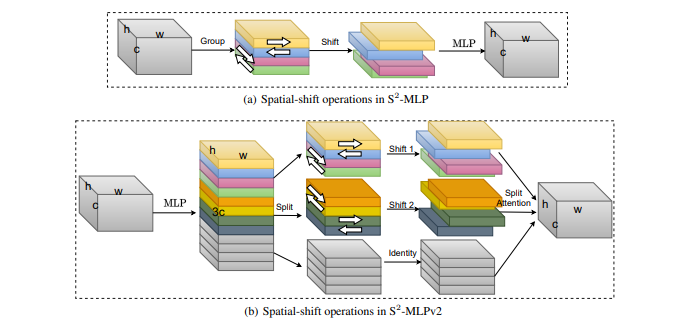

* Jittor and Pytorch implementaion of [ConvMixer: Patches Are All You Need?](https://openreview.net/pdf?id=TVHS5Y4dNvM).

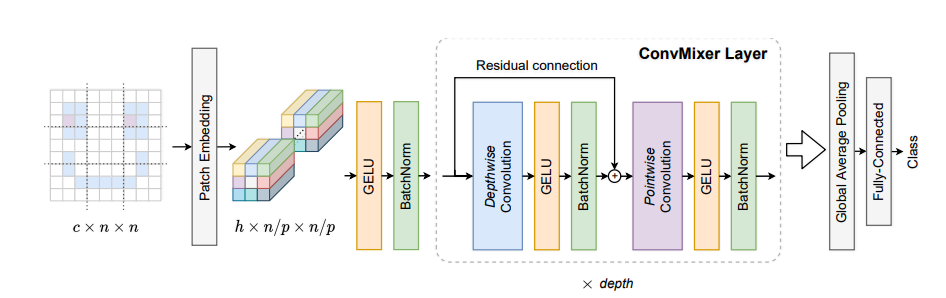

* Jittor and Pytorch implementaion of [ConvMLP: Hierarchical Convolutional MLPs for Vision](https://arxiv.org/abs/2109.04454).

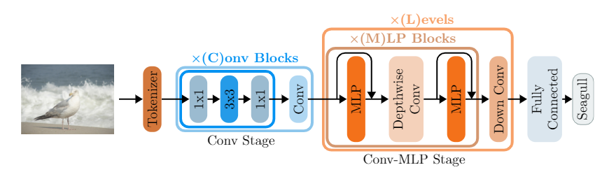

* Jittor and Pytorch implementaion of [RaftMLP: Do MLP-based Models Dream of Winning Over Computer Vision?](https://arxiv.org/abs/2108.04384).

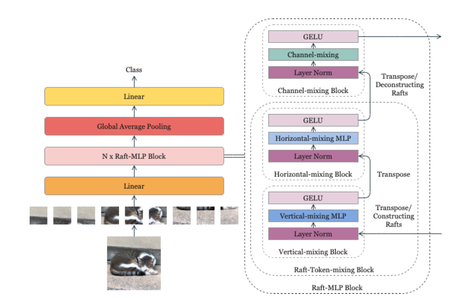

* Jittor and Pytorch implementaion of [Sparse MLP for Image Recognition: Is Self-Attention Really Necessary?](https://arxiv.org/abs/2109.05422).

  From Pytorch to Jittor only need **two step**:

  * modify `forward` to `execute` 
  * modify `torch.cat` to `jt.concat`

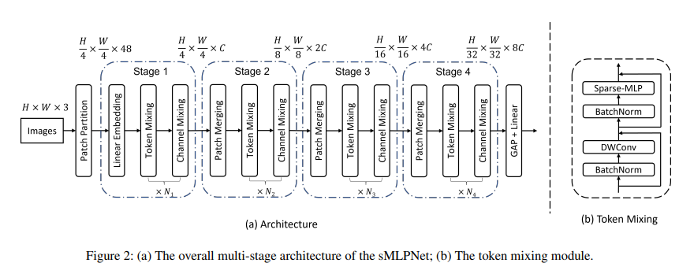

* Jittor and Pytorch implementaion of [Hire-MLP: Vision MLP via Hierarchical Rearrangement](https://arxiv.org/abs/2108.13341).

  From Pytorch to Jittor only need **three step**:

  * modify `forward` to `execute` 
  * modify `torch.roll` to `jt.roll`
  * modify `torch.nn.function.pad` to `jt.nn.pad`

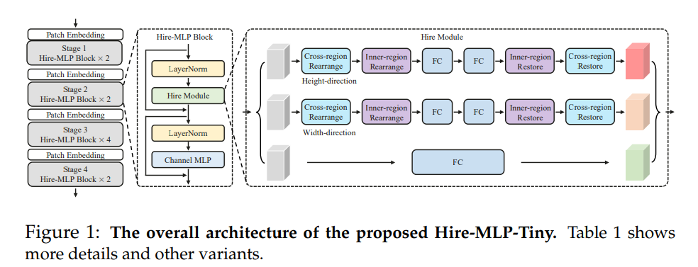

* Pytorch implementaion of [Global filter networks for image classification](https://arxiv.org/abs/2107.00645).

  **There is no fft operation in Jittor**!

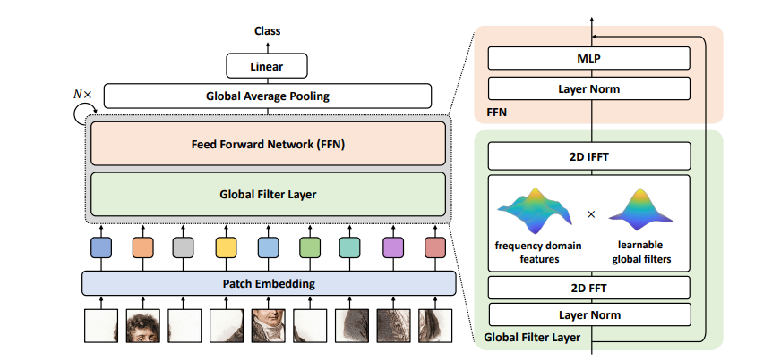

* Pytorch implementaion of [Cyclemlp: A mlp-like architecture for dense prediction](https://arxiv.org/abs/2107.10224).

  `from torchvision.ops.deform_conv import deform_conv2d as deform_conv2d_tv`

  **But There is no deform\_conv in Jittor**!  -- I find in JDet, but there is still some problems to be solved.

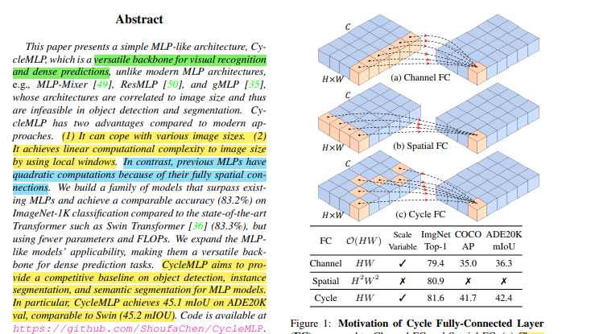

* Jittor and Pytorch implementaion of [As-mlp: An axial shifted mlp architecture for vision](https://arxiv.org/abs/2107.08391).
  * AS-MLP Pytorch, shift is implemented by cupy, and can only run on GPU.
  * AS-MLP Jittor, **shift can be implemented in two lines** , and can run on both CPU and GPU.

```python
import jittor as jt
n,c,h,w = 2,10,4,5
x = jt.random((n,c,h,w))

def shift(x, h_offset, h_stride, h_cycle, w_offset, w_stride, w_cycle):
    return x.reindex([n,c,h,w], ["i0", "i1", 
        f"(i1%{h_cycle})*{h_stride}+{h_offset}+i2",
        f"(i1%{w_cycle})*{w_stride}+{w_offset}+i3"])

# y = shift(x, -1, 1, 3, 0, 0, 1)
y = shift(x, 0, 0, 1, -1, 1, 3)
print(x[0,:5])
print(y[0,:5])
```

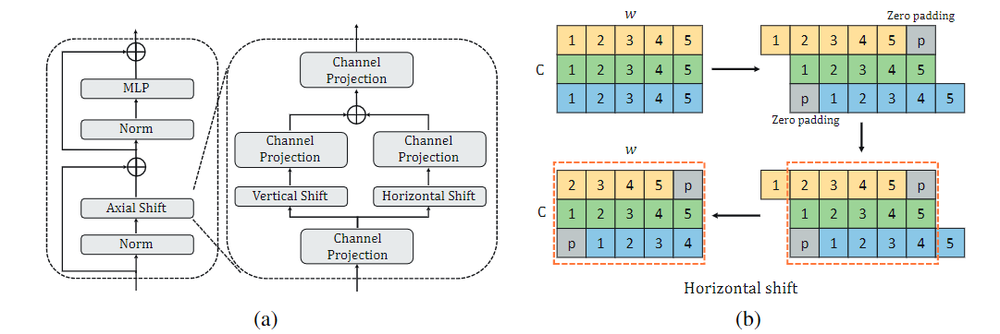

* Jittor and Pytorch implementaion of [RepMLPNet: Hierarchical Vision MLP with Re-parameterized Locality](https://arxiv.org/abs/2112.11081).

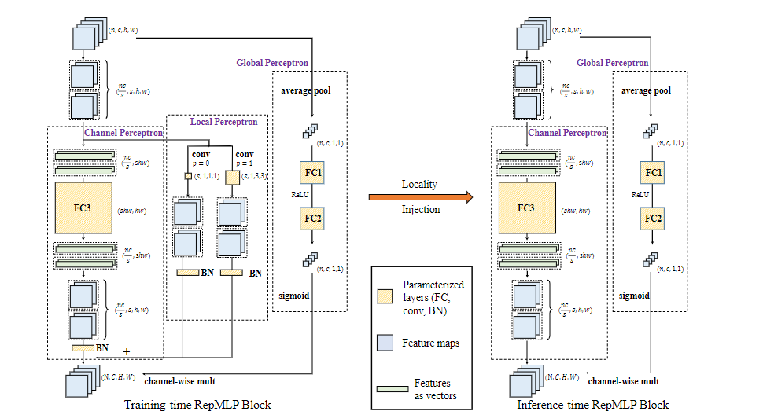

* Jittor and Pytorch implementaion of [An image patch is a wave: Phase-aware vision mlp](https://arxiv.org/abs/2111.12294).

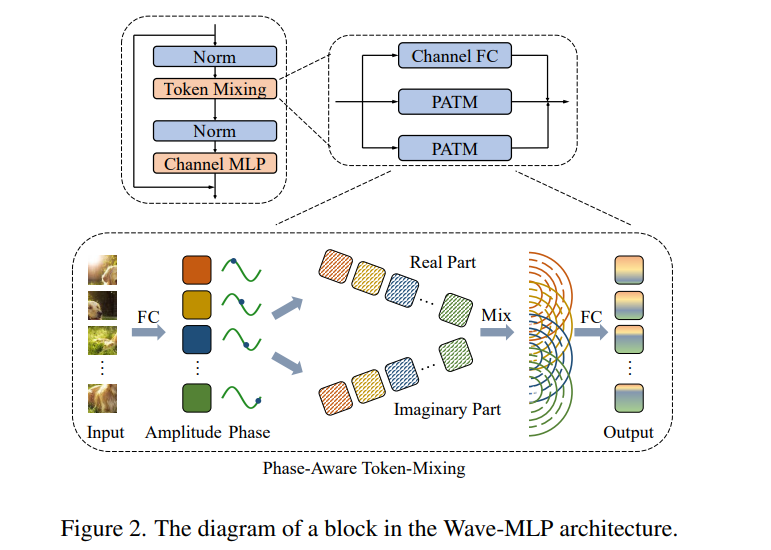

* Jittor and Pytorch implementaion of [Mixing and Shifting: Exploiting Global and Local Dependencies in Vision MLPs](https://arxiv.org/abs/2202.06510).

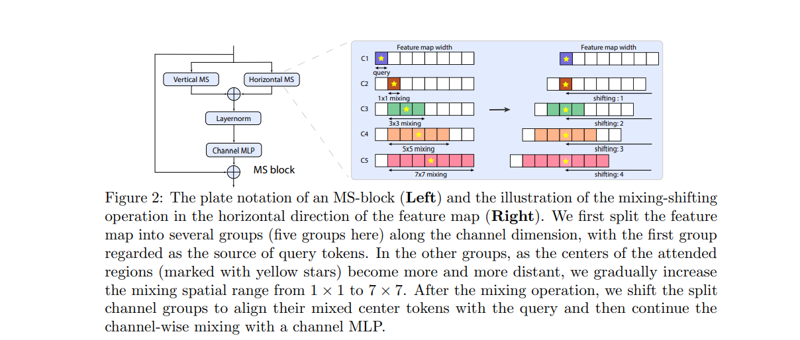

* Jittor and Pytorch implementaion of [MorphMLP: A Self-Attention Free, MLP-Like Backbone for Image and Video](https://arxiv.org/abs/2111.12527).

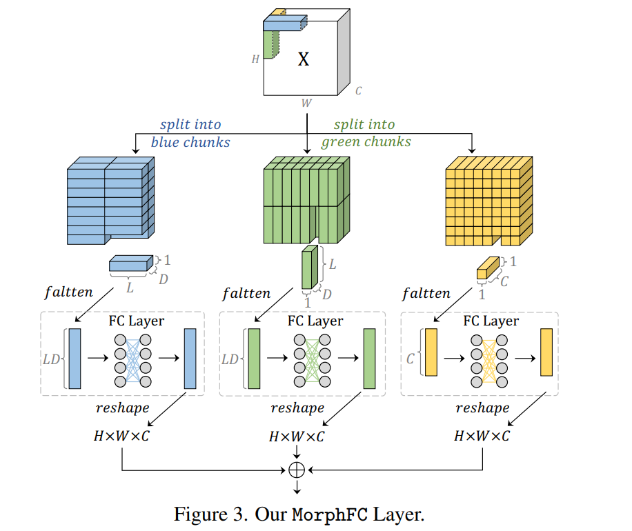

* Jittor and Pytorch implementaion of [DynaMixer: A Vision MLP Architecture with Dynamic Mixing](https://arxiv.org/abs/2201.12083).

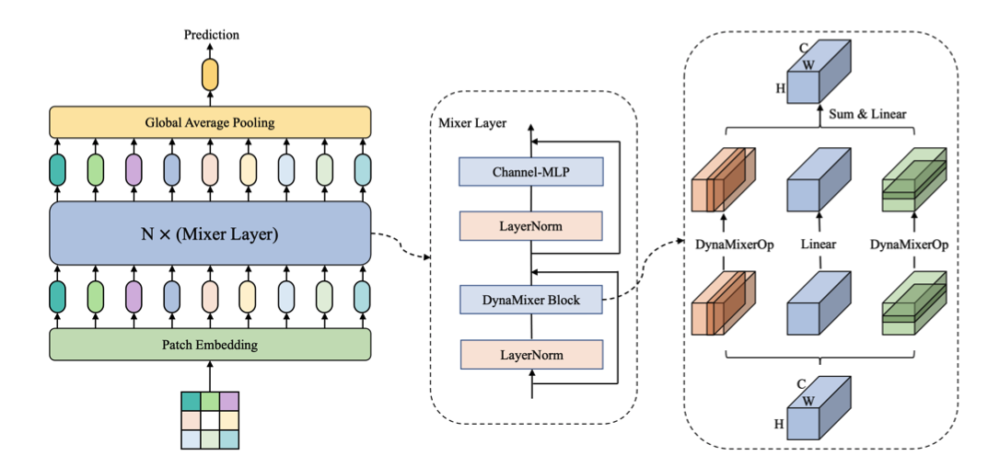

## Usage

```python
import jittor as jt
from models_jittor import gMLPForImageClassification as gMLP_jt
from models_jittor import ResMLPForImageClassification as ResMLP_jt
from models_jittor import MLPMixerForImageClassification as MLPMixer_jt
from models_jittor import ViP as ViP_jt
from models_jittor import S2MLPv2 as S2MLPv2_jt
from models_jittor import S2MLPv1_deep as S2MLPv1_deep_jt 
from models_jittor import ConvMixer as ConvMixer_jt
from models_jittor import convmlp_s as ConvMLP_s_jt 
from models_jittor import convmlp_l as ConvMLP_l_jt 
from models_jittor import convmlp_m as ConvMLP_m_jt 
from models_jittor import RaftMLP as RaftMLP_jt
from models_jittor import SparseMLP as SparseMLP_jt
from models_jittor import HireMLP as HireMLP_jt
from models_jittor import AS_MLP as AS_MLP_jt
from models_jittor import SwinMLP as SwinMLP_jt
from models_jittor import WaveMLP as WaveMLP_jt
from models_jittor import MS_MLP as MS_MLP_jt
from models_jittor import MorphMLP as MorphMLP_jt
from models_jittor import DynaMixer as DynaMixer_jt

model_jt = MLPMixer_jt(
    image_size=(224,112),
    patch_size=16,
    in_channels=3,
    num_classes=1000,
    d_model=256,
    depth=12,
)

images = jt.randn(8, 3, 224, 224)
with jt.no_grad():
    output = model_jt(images)
print(output.shape) # （8， 1000）

############################################################################

import torch
from models_pytorch import gMLPForImageClassification as gMLP_pt
from models_pytorch import ResMLPForImageClassification as ResMLP_pt
from models_pytorch import MLPMixerForImageClassification as MLPMixer_pt
from models_pytorch import ViP as ViP_pt
from models_pytorch import S2MLPv2 as S2MLPv2_pt 
from models_pytorch import S2MLPv1_deep as S2MLPv1_deep_pt
from models_pytorch import ConvMixer as ConvMixer_pt 
from models_pytorch import convmlp_s as ConvMLP_s_pt 
from models_pytorch import convmlp_l as ConvMLP_l_pt 
from models_pytorch import convmlp_m as ConvMLP_m_pt 
from models_pytorch import RaftMLP as RaftMLP_pt
from models_pytorch import SparseMLP as SparseMLP_pt
from models_pytorch import HireMLP as HireMLP_pt
from models_pytorch import GFNet as GFNet_pt
from models_pytorch import CycleMLP_B2 as CycleMLP_B2_pt
from models_pytorch import AS_MLP as AS_MLP_pt
from models_pytorch import SwinMLP as SwinMLP_pt
from models_pytorch import create_RepMLPNet_B224, create_RepMLPNet_B256
from models_pytorch import WaveMLP as WaveMLP_pt
from models_pytorch import MS_MLP as MS_MLP_pt
from models_pytorch import MorphMLP as MorphMLP_pt
from models_pytorch import DynaMixer as DynaMixer_pt

model_pt = ViP_pt(
    image_size=224,
    patch_size=16,
    in_channels=3,
    num_classes=1000,
    d_model=256,
    depth=30,
    segments = 16,
    weighted = True
)

images = torch.randn(8, 3, 224, 224)

with torch.no_grad():
    output = model_pt(images)
print(output.shape) # （8， 1000）


############################## Non-square images and patch sizes #########################

model_jt = ViP_jt(
    image_size=(224, 112),
    patch_size=(16, 8),
    in_channels=3,
    num_classes=1000,
    d_model=256,
    depth=30,
    segments = 16,
    weighted = True
)
images = jt.randn(8, 3, 224, 112)
with jt.no_grad():
    output = model_jt(images)
print(output.shape) # （8， 1000）

############################## 2 Stages S2MLPv2 #########################
model_pt = S2MLPv2_pt(
    in_channels = 3,
    image_size = (224,224),
    patch_size = [(7,7), (2,2)],
    d_model = [192, 384],
    depth = [4, 14],
    num_classes = 1000, 
    expansion_factor = [3, 3]
)

############################## ConvMLP With Pretrain Params #########################
model_jt = ConvMLP_s_jt(pretrained = True, num_classes = 1000)


############################## RaftMLP #########################
model_jt = RaftMLP_jt(
        layers = [
            {"depth": 12,
            "dim": 768,
            "patch_size": 16,
            "raft_size": 4}
        ],
        gap = True
    )

############################## SparseMLP #########################
model_pt = SparseMLP_pt(
        image_size=224,
        patch_size=4,
        in_channels=3,
        num_classes=1000,
        d_model=96,
        depth=[2,10,24,2],
        expansion_factor = 2,
        patcher_norm= True
    )

############################## HireMLP #########################

model_pt = HireMLP_pt(
        patch_size=4,
        in_channels=3,
        num_classes=1000,
        d_model=[64, 128, 320, 512],
        h = [4,3,3,2],
        w = [4,3,3,2],
        cross_region_step = [2,2,1,1],
        cross_region_interval = 2,
        depth=[4,6,24,3],
        expansion_factor = 2,
        patcher_norm = True,
    	padding_type = 'circular',
    )

############################## GFNet #########################
model_pt = GFNet_pt()


############################## CycleMLP #########################
model_pt = CycleMLP_B2_pt()

############################## AS-MLP #########################
model_pt = AS_MLP_pt()

############################## WaveMLP #########################
model_pt = WaveMLP_pt('M')

############################## MS-MLP #########################
model_pt = MS_MLP_pt()

############################## MorphMLP #########################
model_pt = MorphMLP_pt('B')

############################## DynaMixer #########################
model_pt = DynaMixer_pt('M')
```


## Citations

```bibtex
@misc{tolstikhin2021mlpmixer,
    title   = {MLP-Mixer: An all-MLP Architecture for Vision},
    author  = {Ilya Tolstikhin and Neil Houlsby and Alexander Kolesnikov and Lucas Beyer and Xiaohua Zhai and Thomas Unterthiner and Jessica Yung and Daniel Keysers and Jakob Uszkoreit and Mario Lucic and Alexey Dosovitskiy},
    year    = {2021},
    eprint  = {2105.01601},
    archivePrefix = {arXiv},
    primaryClass = {cs.CV}
}
```

```bibtex
@misc{hou2021vision,
    title   = {Vision Permutator: A Permutable MLP-Like Architecture for Visual Recognition},
    author  = {Qibin Hou and Zihang Jiang and Li Yuan and Ming-Ming Cheng and Shuicheng Yan and Jiashi Feng},
    year    = {2021},
    eprint  = {2106.12368},
    archivePrefix = {arXiv},
    primaryClass = {cs.CV}
}
```

```bibtex
@article{liu2021pay,
  title={Pay Attention to MLPs},
  author={Liu, Hanxiao and Dai, Zihang and So, David R and Le, Quoc V},
  journal={arXiv preprint arXiv:2105.08050},
  year={2021}
}
```

```bibtex
@article{touvron2021resmlp,
  title={Resmlp: Feedforward networks for image classification with data-efficient training},
  author={Touvron, Hugo and Bojanowski, Piotr and Caron, Mathilde and Cord, Matthieu and El-Nouby, Alaaeldin and Grave, Edouard and Joulin, Armand and Synnaeve, Gabriel and Verbeek, Jakob and J{\'e}gou, Herv{\'e}},
  journal={arXiv preprint arXiv:2105.03404},
  year={2021}
}
```

```bibtex
@article{yu2021s,
  title={S $\^{} 2$-MLPv2: Improved Spatial-Shift MLP Architecture for Vision},
  author={Yu, Tan and Li, Xu and Cai, Yunfeng and Sun, Mingming and Li, Ping},
  journal={arXiv preprint arXiv:2108.01072},
  year={2021}
}
```

```bibtex
@article{li2021convmlp,
  title={ConvMLP: Hierarchical Convolutional MLPs for Vision},
  author={Li, Jiachen and Hassani, Ali and Walton, Steven and Shi, Humphrey},
  journal={arXiv preprint arXiv:2109.04454},
  year={2021}
}
```

```bibtex
@article{tatsunami2021raftmlp,
  title={RaftMLP: Do MLP-based Models Dream of Winning Over Computer Vision?},
  author={Tatsunami, Yuki and Taki, Masato},
  journal={arXiv preprint arXiv:2108.04384},
  year={2021}
}
```

```bibtex
@article{tang2021sparse,
  title={Sparse MLP for Image Recognition: Is Self-Attention Really Necessary?},
  author={Tang, Chuanxin and Zhao, Yucheng and Wang, Guangting and Luo, Chong and Xie, Wenxuan and Zeng, Wenjun},
  journal={arXiv preprint arXiv:2109.05422},
  year={2021}
}
```

```bibtex
@article{guo2021hire,
  title={Hire-MLP: Vision MLP via Hierarchical Rearrangement},
  author={Guo, Jianyuan and Tang, Yehui and Han, Kai and Chen, Xinghao and Wu, Han and Xu, Chao and Xu, Chang and Wang, Yunhe},
  journal={arXiv preprint arXiv:2108.13341},
  year={2021}
}
```

```bibtex
@article{rao2021global,
  title={Global filter networks for image classification},
  author={Rao, Yongming and Zhao, Wenliang and Zhu, Zheng and Lu, Jiwen and Zhou, Jie},
  journal={arXiv preprint arXiv:2107.00645},
  year={2021}
}
```

```bibtex
@article{chen2021cyclemlp,
  title={Cyclemlp: A mlp-like architecture for dense prediction},
  author={Chen, Shoufa and Xie, Enze and Ge, Chongjian and Liang, Ding and Luo, Ping},
  journal={arXiv preprint arXiv:2107.10224},
  year={2021}
}
```

```bibtex
@article{lian2021mlp,
  title={As-mlp: An axial shifted mlp architecture for vision},
  author={Lian, Dongze and Yu, Zehao and Sun, Xing and Gao, Shenghua},
  journal={arXiv preprint arXiv:2107.08391},
  year={2021}
}
```

```bibtex
@article{ding2021repmlpnet,
  title={RepMLPNet: Hierarchical Vision MLP with Re-parameterized Locality},
  author={Ding, Xiaohan and Chen, Honghao and Zhang, Xiangyu and Han, Jungong and Ding, Guiguang},
  journal={arXiv preprint arXiv:2112.11081},
  year={2021}
}
```

```bibtex
@article{tang2021image,
  title={An image patch is a wave: Phase-aware vision mlp},
  author={Tang, Yehui and Han, Kai and Guo, Jianyuan and Xu, Chang and Li, Yanxi and Xu, Chao and Wang, Yunhe},
  journal={arXiv preprint arXiv:2111.12294},
  year={2021}
}
```

```bibtex
@article{zheng2022mixing,
  title={Mixing and Shifting: Exploiting Global and Local Dependencies in Vision MLPs},
  author={Zheng, Huangjie and He, Pengcheng and Chen, Weizhu and Zhou, Mingyuan},
  journal={arXiv preprint arXiv:2202.06510},
  year={2022}
}
```

```bibtex
@article{zhang2021morphmlp,
  title={MorphMLP: A Self-Attention Free, MLP-Like Backbone for Image and Video},
  author={Zhang, David Junhao and Li, Kunchang and Chen, Yunpeng and Wang, Yali and Chandra, Shashwat and Qiao, Yu and Liu, Luoqi and Shou, Mike Zheng},
  journal={arXiv preprint arXiv:2111.12527},
  year={2021}
}
```

```bibtex
@article{wang2022dynamixer,
  title={DynaMixer: A Vision MLP Architecture with Dynamic Mixing},
  author={Wang, Ziyu and Jiang, Wenhao and Zhu, Yiming and Yuan, Li and Song, Yibing and Liu, Wei},
  journal={arXiv preprint arXiv:2201.12083},
  year={2022}
}
```

